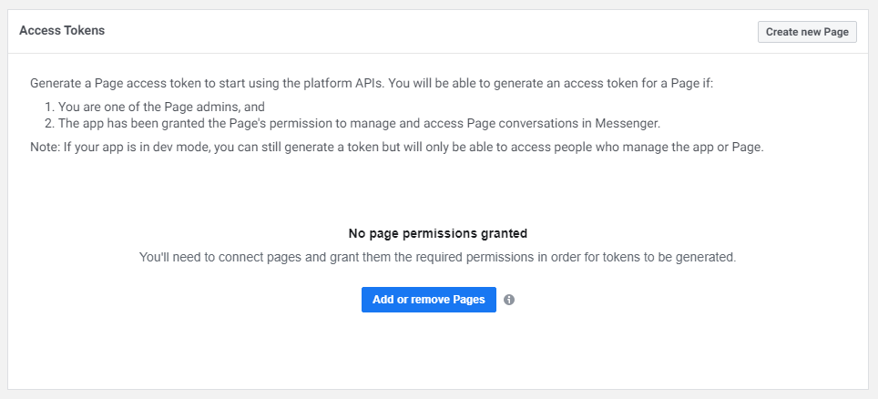
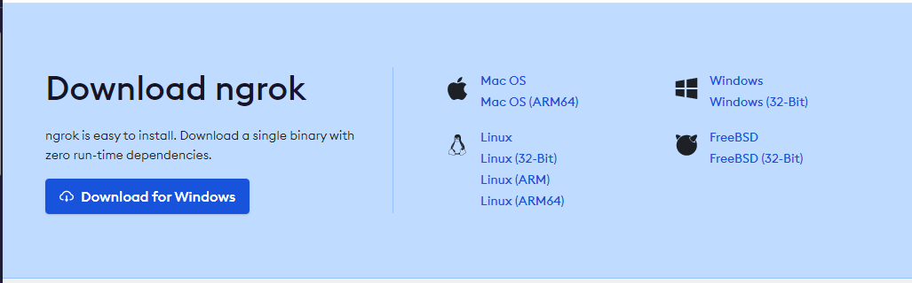
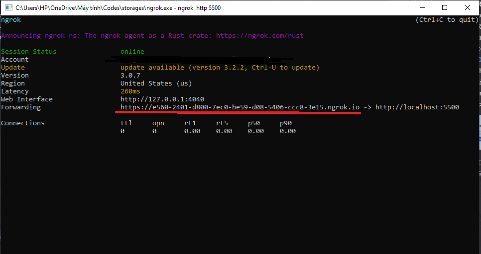
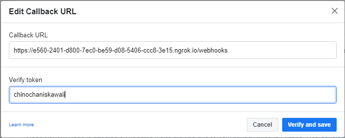

## 1. Những thứ cần có:
- 1 trang Fanpage của Facebook, nếu bạn không có thì bạn có thể tạo nó [ở đây](https://www.facebook.com/pages/creation/).
- Nếu bạn chưa tải Node.JS thì bạn có thể tải nó [ở đây](https://www.nodejs.org/).
- Sau khi bạn đã có 1 trang Fanpage thì bạn vô trang [Facebook Developers](https://developers.facebook.com/) (chưa có tài khoản thì tạo nhé :>), vào phần [My Apps](https://developers.facebook.com/apps/) (chưa có cũng tạo nốt nhé, không biết cách tạo thì mình sẽ hướng dẫn ở ý dưới nhé :>) rồi chọn App của bạn.
- ChatGPT API Token, lấy nó [ở đây](https://platform.openai.com/account/api-keys).

## 2. Cách tạo App:
- Ở phần 1, nếu như bạn không biết cách tạo sao cho đúng thì bạn có thể xem ở đây nhé (ai biết rồi bỏ qua nhé :>).
- Nhấn vào **[tạo App](https://developers.facebook.com/apps/creation/) -> Other -> None -> Ghi tên của app bạn rồi bấm Create App nhé :>**

## 3. Hướng dẫn làm:
- Vào file **config.js** và 

- Bấm lệnh **npm start** trong terminal, sau khi bấm hiện ra **App đang chạy tại port: {port}** thì đừng thoát ra, để yên đó:

- Sau khi tạo App xong rồi thì bạn nhìn vào phần **Add a product** tìm **Messenger** rồi nhấn vô **Set up**, nó sẽ tạo cho bạn 1 **Messenger Product**
- Tìm **Access Token** trong **Product Messenger** như hình bên:

</img>

- Bấm vào **Add or remove Pages**:
- Chọn trang bạn muốn tích hợp rồi bấm **Done** thôi.
- Bấm vào **Generate token**:

</img>

- Tích vào **I Understand** và copy lấy token và đặt trong file **config.js** (không được để lộ hay chia sẻ cho ai token này nhé, Replit thì để vào Secret nhé :>).

```js
// config.js
const NodeCache = require("node-cache")

const config = {
    pageToken: '', // Đưa token của fanpage của bạn vô đây.
    appSecret: '', // Cái này có thể có hoặc không, nếu có thì nó càng bảo mật.
    verifyToken: '', // Nhập cái gì vô đây cũng được nhưng nhớ copy vào Verify Token ở mục Webhooks.
    openai: {
        model: '', // Model ChatGPT (gpt-3-turbo, gpt-3, gpt-4)
        token: '', // API Token của ChatGPT
        max_tokens: 2048 // Bạn có thể thay đổi theo bạn muốn.
    },
    baseURL: 'https://graph.facebook.com/v16.0',
    ratelimit: new Map(),
    cache: new NodeCache({
        checkperiod: 10000,
        deleteOnExpire: true
    }),
    port: 5500
}

module.exports = config
```
- Vào phần **Webhooks** và bấm **Add Callback URL**.
- Cách lấy Callback URL nó ở phần 4 nhé, sau khi bạn lấy xong thì bạn paste vào ô Callback URL và thêm **/webhooks** và sau URL bạn paste nhé.

- **Verify token** thì bạn ghi gì cũng được nhưng nhớ bỏ vào **config.js** trước khi bấm **Verify and save** nhé (và đừng để lộ cho ai).

- Sau khi bấm **Verify and save** và bạn thấy trên terminal có **Webhooks Verified** thì bạn đã thành công rồi.

- Cấp quyền page cho App của bạn: Bấm vào **Add subscriptions** và tích vào **messages** là bạn xong rồi đấy.

- Giờ thì chat với với Page thôi :>

## 4. Lấy Callback URL:
- Cái này rất quan trọng vì Facebook gửi những sự kiện gửi tin nhắn của người dùng bằng [Webhooks](https://en.wikipedia.org/wiki/Webhook).
- Nếu bạn clone source code ở Replit thì bạn chỉ cần bấm **Run** thì nó sẽ hiện luôn cho bạn địa chỉ trang web của Repl của bạn, và bạn có thể tiếp tục thay vì đọc tiếp nhé :>
- **[Dùng ngrok](https://ngrok.com/)**: Sau khi login (hay tạo tài khoản) xong thì tải về nhé (nhớ đừng thoát trang web sau khi tải xong :>).

</img>

- Tải về rồi giải nén bạn sẽ có file **ngrok.exe**, bấm vào đó rồi trở lại web ngrok rồi copy và paste phần lệnh ở phần **Connect your account** vào terminal đang mở bởi ngrok.

- Bấm lệnh sau đây:
```sh
ngrok http 5500
```
- Sau khi bạn thấy giống ảnh bên dưới thì bạn copy URL mình gạch ngang màu đỏ nhé (không được tắt terminal này đi).



- Paste URL vào phần Callback URL và thêm **/webhooks** nhé:

</img>

- Sau khi bấm **Verify and save** và bạn thấy trên terminal có **Webhooks Verified** thì bạn đã thành công rồi.

## 5. Hỗ trợ:
- Discord: https://discord.gg/aMFuE5UKZH